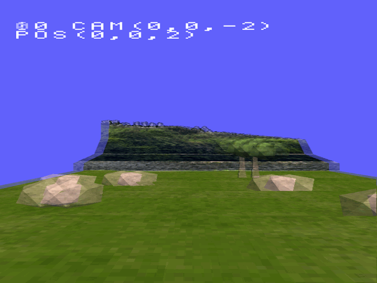
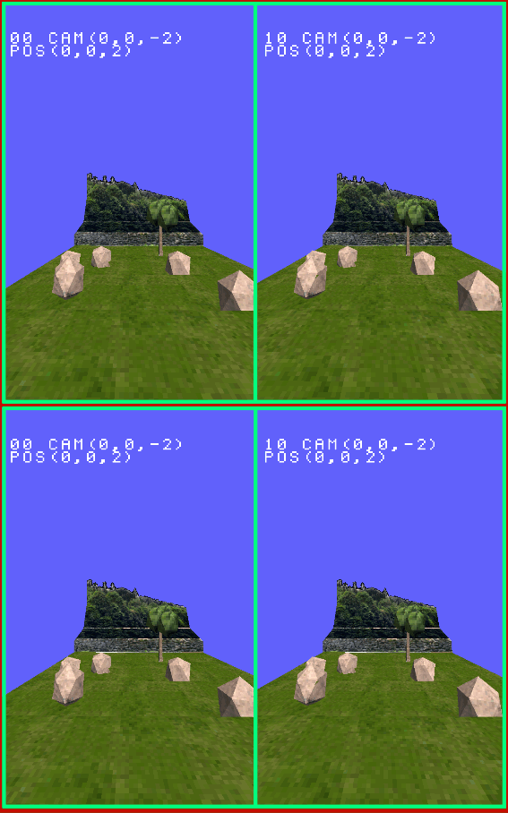
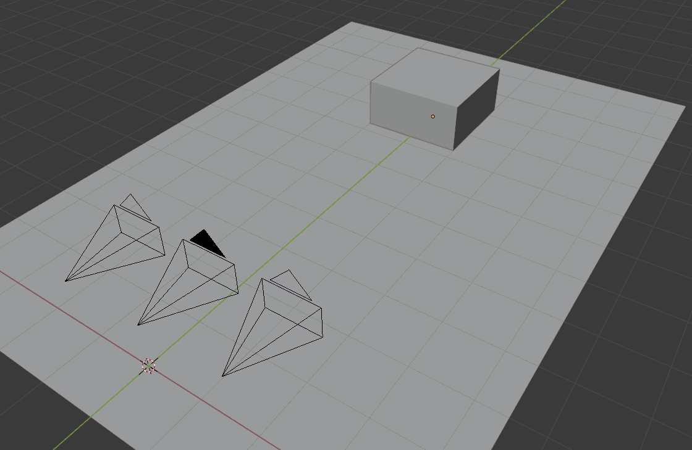
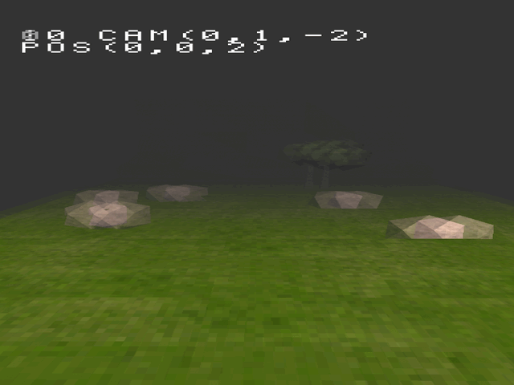
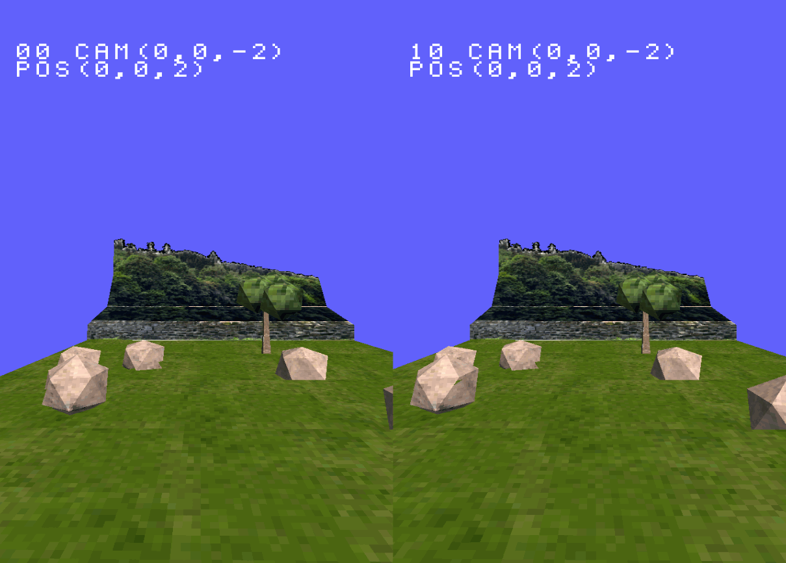
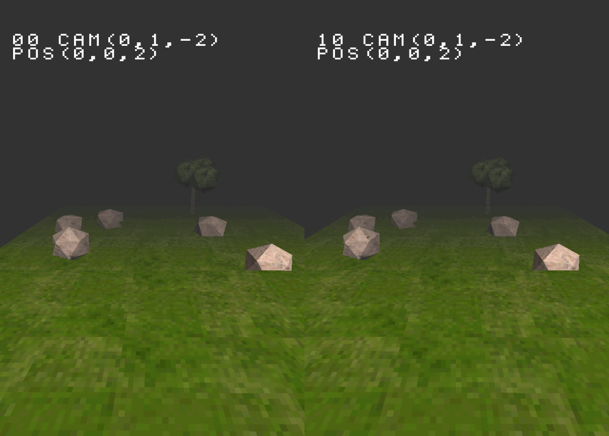
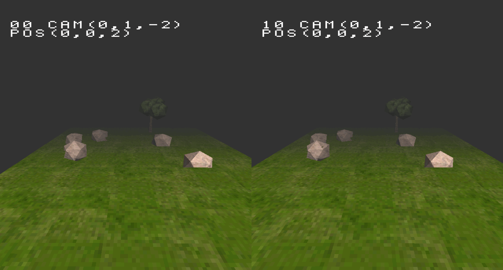

# Introduction
When I was developing on PlayStation 1 (aka PS1 or PSX), I wanted to develop something unusual on this platform. So, I was starting to research how to implement 3D stereoscopic functionality on PSX. Long story short, It works. Therefore, the following will discuss.

_This repository is for research and educational purposes._

**Author:** MSc Jiří Fajta
**Initial document date:** 25-03-2026
**Code implementation:** 2025

    

HSBS image on 3DTV. 

# Table of contents
* Methods about stereoscopic image format
* About analog video signal combined with stereoscopic
* Implementation of stereoscopic rendering on PSX
* Impact of the resolution
* Bonus: Light support and Silent Hill fog
* Code

# Methods about stereoscopic image format
Methods to transfer stereoscopic image
This chapter will only focus to explain two methods very briefly.
* Dual Stream/Output [Multiview Video Coding](https://www.merl.com/publications/docs/TR2011-022.pdf) (MVC) This contains two full resolution images for left and right eye that is encoded into each video stream separately and send over HDMI. This method is not possible on the PSX retail hardware as-is.

* Half Side-by-Side ([Half SBS or HSBS](https://inairspace.com/blogs/learn-with-inair/side-by-side-3d-format-complete-guide-to-immersive-stereoscopic-video)) The left and right images are squashed horizontally into single image. Where horizontal resolution of each images is reduced by half compared to targeted resolution.

# About analog video signal combined with stereoscopic
PSX video signal output is analog, so the question that came to mind; _“Is it possible to use interlaced image signal to achieve something similar to MVC?”_.
I gave it a shot to try this.
Here the breakdown. Yes, it is possible to use left image on odd lines and right image on even lines. Where these images would be off in 1/50th (PAL) or 1/59.94th (NTSC) of a second which is fine, because the images are also calculated at different time at the same delay. But the limitation is in the settings of a retail 3D TV.
3D TV’s do not have a setting to filter an interlaced analog video signal from odd and even lines into 3D stereoscopic image for each eye. 3D TV does the following. It takes the interlaced image as a hole and converts this 2D image into 3D stereoscopic image which results in an interlaced visual mess. Meaning, that TV converts regular 2D image and tries to simulate a 3D image. In this proof of concept, an LCD Samsung 40” D6500 was used. This model makes use of [active shutter glasses](https://en.wikipedia.org/wiki/Active_shutter_3D_system). 

Second about analog signal. 3D TV’s support Half Side-by-Side video input to convert into 3D stereoscopic image, but my experience is that this does only work with a digital video input like HDMI. Because 3D TV’s that uses an analog video input supports only to convert 2D image into simulated 3D image as mentioned before. This is a setting that must be avoided in this setup. There is a workaround, connect a PlayStation analog video output (highly recommended to use Scart RGB or S-VIDEO for better sharpness) to an “analog to HDMI converter” and put this HDMI output into your 3D TV. Then the Side-by-Side setting is available to convert into 3D image.

The method that I ended up using, was to implement Half Side-by-Side.
You can try out 3 images (here at the bottom) on your 3DTV by connecting your PC to 3DTV via HDMI and set TV to 3D mode using SBS horizontal.

# Implementation of stereoscopic rendering on PSX
Two cameras are needed in a world space. Therefore, it is fairly identical to a two player split screen approach. 
4 drawing buffers and 2 display buffers are needed when using double buffering (upper 2 draw-buffers are the first display-buffer and bottom 2 draw-buffers are the second display-buffer).
These 4 buffers are used for left and right screen for each eye and both are double buffered (display- and draw-buffer).
 
_PSX VRAM double buffered left and right image._ 

Virtually I use a third camera as a center point for the two “3D stereoscopic cameras“. I will mention these two “stereo cameras” for short. Fly camera system was implemented to move these camera in world space for great experience.
 
_Stereoscopic camera setup. Standard camera centered, left- and right-camera for stereoscopic image.Illustration made in Blender._

Ideal offset for the 2 stereo cameras is 384 units with respect to camera center (i.e. 2 x 384 between the 2 stereo cameras.) Use 512 units offset to have stronger 3D effect. Note that this world space was defined as 12bit fixed-point decimal (i.e. 4096 units represents ONE).
This program supports real-time changing offset of the cameras. Notable difference is by increasing or decreasing by steps of 128 units for the offset.

# Impact of the resolution
Internal PSX resolution plays an imported role. Minimal resolution of 512x240 is needed for horizontal HSBS to have a noticeable 3D stereoscopic effect. Lower resolution like 320x240 will result in a not noticeable 3D effect.
It is possible to program an executable file with An internal resolution of 320x240 and use a PSX emulator to set enhanced internal resolution to 1920x1080. This works very well, actually better then native resolution of 512x240.

Do not forget to squash the view space on x-axis accordingly by scaling 3D objects on screen before projection. The screen space image will be stretched during HSBS 3D TV process on x-axis.

Apply scale to matrix:
VECTOR scale = {2048, ONE, ONE};// scale x-axis by half. 
ScaleMatrixL(&camera->matrix, &scale);

# Bonus: Light support and Silent Hill fog
Light support and Silent Hill fog was implemented. 

_HSBS Silent Hill fog 16x9 on 3DTV._ 

Moreover, I was inspired by Silent Hill fog which surprised me that this is not an out of the box solution in the PSX hardware. Which in contrast a fog distance color is. This works best with black color only.
I would like to thank _Elias Daler_ for his publication on YouTube about the implementation of Silent Hill fog. These are his resources:
* [I implemented Silent Hill Fog In My Real PS1 Game](https://www.youtube.com/watch?v=EwpFdMJlVP4])
* [How Silent Hill works on PS1](https://eliasdaler.itch.io/ps1-fog])

His explanation was detailed enough to implement this fog. But I have to point out an implementation aspect that I struggled with. Although front and back polygons where correctly ordered into ordering table on PSX. It still resulted in translucent polygons rather the gray-ish polygons in the distance. Therefore, both polygons needs to be merged as one large primitive using _MargePrim(polygon_primitive0_poly_fog, polygon_primitive1_poly)_ function and then add to ordering table using _AddPrim(polygon_primitive0_poly_fog)_ only.

_HSBS image for left and right eye._ 

_HSBS Silent Hill fog 4x3._ 

_HSBS Silent Hill fog 16x9._ 

# Code
Code running this demo is not made public, but this repository provide some snipped code to provide some idea on how to implement stereoscopic rendering. Also what I want to mention, is that split screen approach in this snipped code is not ideal. Draw command and updating polygon primitives are not processed in parallel which results in less performance.
[Snipped code](https://github.com/jirifajta/src/psx3dStereoscopicSnipped.c) provides high level idea about how to implement 3D Stereoscopic.
